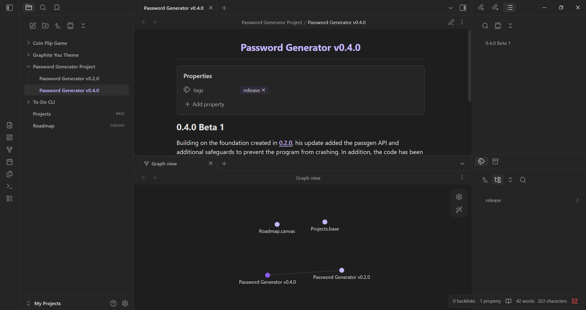
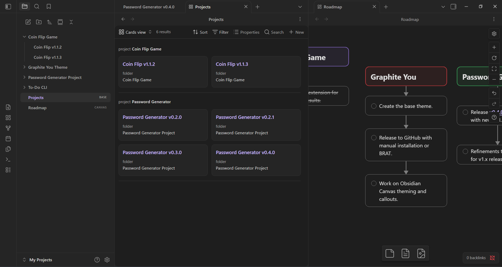
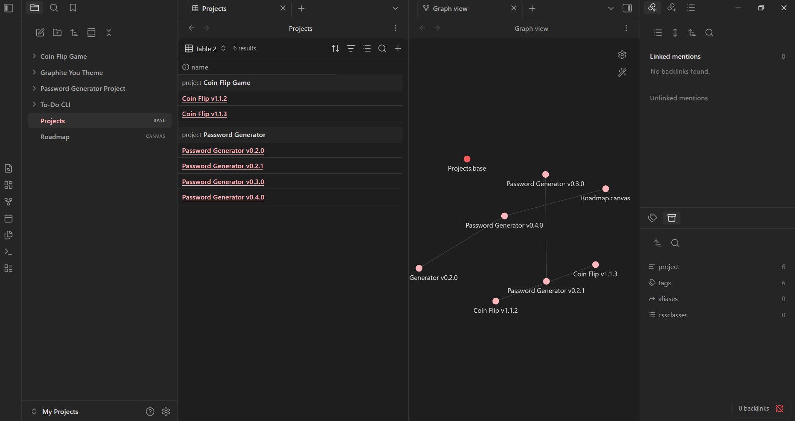

## Graphite You
An Obsidian theme that works with your chosen accent colour on top of a monochrome base.

### A theme that adapts to you.

Graphite You is a theme inspired by Material You's dynamic colour engine. Your Obsidian accent colour is applied to UI elements on top of a neutral monochrome base.

### And I didn't forget about Bases and Canvas

Your Obsidian bases views get the same treatment - a modern and neutral UI with a splash of colour.

I will be giving Canvas a refresh in a future release.

### And here's another accent colour...
